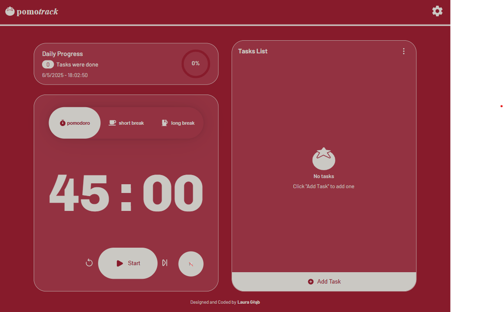

# ⏱️ PomoTrack – Stay Focused, Get Things Done

## Table of Contents  
- [About the Project](#about-the-project)  
- [Features](#features)  
- [How It Works](#how-it-works)  
- [Why PomoTrack?](#why-pomotrack)  
- [Built With](#built-with)  
- [License](#license)  

## About the Project  
**PomoTrack** is a powerful productivity app that blends the **Pomodoro Technique** with a fully featured **To-Do list**, helping you manage time, focus better, and accomplish tasks efficiently.  
Created to support structured workflows and mindful breaks, this app allows users to tailor their productivity rhythm while tracking progress and maintaining task clarity.

## Features  
### ⏳ **Pomodoro Timer Modes**  
- 3 modes: **Productive Time**, **Short Break**, **Long Break**  
- Customizable durations for each mode  
- Theme changes dynamically based on the current mode  
- Ambient **focus sounds** (e.g., white noise) for deeper concentration  

### 📝 **Smart To-Do List**  
- Add tasks with **categories** (6 available)  
- Assign **priority levels**: Low, Medium, High  
- Edit tasks at any time  
- Delete tasks individually, by status (e.g., done only), or clear all  

### 📈 **Productivity Insights**  
- **Time tracker**: Monitor how long you've stayed productive  
- **Date-based logs** for better reflection  
- Track the **number of completed tasks**  

### 🌓 **Dark Mode Support**  
- Automatically applies dark/light themes depending on time of day or mode  
- Enhances visual comfort for long sessions  

### 📱 **Responsive Design**  
- Fully responsive layout with **media queries**  
- Optimized for **desktops**, **tablets**, and **mobile devices**  
- Seamless experience across all screen sizes  

## How It Works  
1. **Set Your Timer**: Choose between productive mode or a break. Customize durations if needed.  
2. **Manage Your Tasks**: Add tasks with relevant categories and priorities.  
3. **Track Your Flow**: Use the timer and ambient sounds to stay in the zone.  
4. **Review Progress**: Check how many tasks you completed and how much time you spent working.

## Why PomoTrack?  
While many Pomodoro apps exist, **PomoTrack** stands out with its deep **task integration**, user-centric **customization**, and sleek, dynamic **UI**. Whether you're a student, freelancer, or full-time worker, this tool gives you full control over your time and tasks — all in one place.

Stay focused, reduce burnout, and **work smarter**, not harder.

## Built With  
- **React** – Fast, modern UI  
- **Vite** – Lightning-fast dev server  
- **CSS Modules** – Scoped styling per component  
- **Custom Hook Architecture** – Clean, modular state management  
- **LocalStorage** – Persistent data without a backend  
- **Sound Integration** – White noise and productivity boosters  
- **Responsive Media Queries** – Adaptive UI for all screen sizes  

## License  
This project is licensed under the **MIT License**.